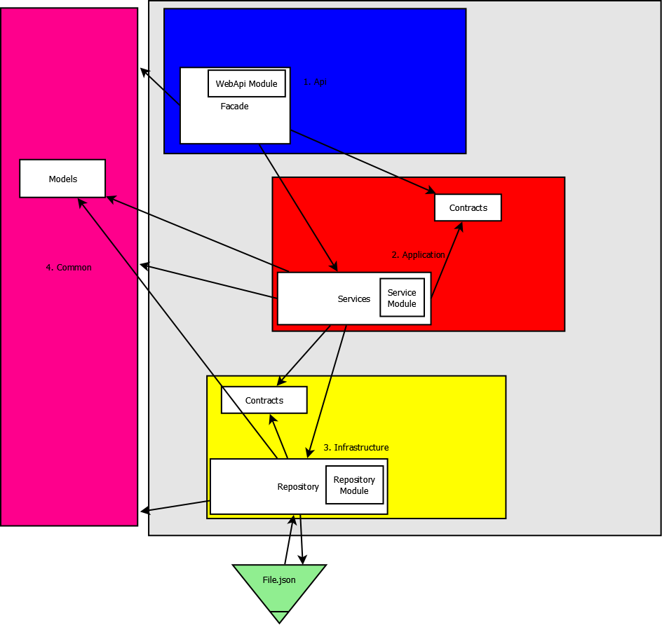

## DIAGRAMA DDD

### Vueling App
### Descripción y contexto
---
Aplicación con arquitectura de capas DDD. Variables en App.Config y Resources.resx. Errores Generados en Log.Error y tratados con VuelingException personalizada.

####Base de Datos
Generamos la Base de Datos con los archivos SQL y FlyWayDB, configurando su archivo conf y con el comando flyway migrate.
Nos creará 2 tablas. Client y Policy. Esta segunda tendrá una referéncia Foránea hacia la primera.

####Capa de Infraestructura
Tenemos separados, cumpliendo con el principio SRP, los proyectos en 2: Repositorio y contratos.
En los contratos encontramos 3 interfaces, incorporando así el principio ISP:
1 para Client con sus métodos propios.
Otra para Policy con los suyos.
Y otra con métodos comunes como pueden ser Operaciones CRUD.

En la capa de Repositorio encontramos separados (SRP) DataModels y los Repositorios.
Los DataModels son generados con una clase ADO, la cual mapeará ambas tablas estableciendo la conexión previamente en el instalador.
En los Repositorios encontraremos 2 clases. Uno para Client y otro para Policy, los cuales se encargarán de persistir y de gestionar los métodos que requieran uso de la Base de datos con Entity Framework.

####Capa de Dominio
En esta encontraremos las entidades ClientEntity y PolicyEntity, las cuales son prácticamente idénticas a sus versiones DataModels, pero he preferido tenerlas separadas para una mayor escalabilidad en el futuro y acostumbrarme así a trabajar de maneras más enfocadas a proyectos de gran envergadura.
A esta capa accederán las capas de Aplicación e Infraestructura.

####Capa de Applicación
En esta encontraremos 3 proyectos: Contratos, Servicios y Dto.
En Contratos, encontraremos prácticamente lo mismo que en el de Contratos de Repositorio. Pero vuelvo a hacer incapié enl a escalabilidad y la separación de responsabilidades.
En Dto encontraremos las clases ClientDto y PolicyDto, los objetos "puente" podríamos llamarlos. En este caso no se pedían diferentes atributos a nivel de capa, pero conviene trabajar con un modelo por capa para mayor reusabilidad modificando lo menos posible o nada el código actual (OCP).
En Servicios, tenemos uno por cada modelo: ClientService y PolicyService.
Estos son los encargados de la lógica de negocio. Se encargará de transmitir los métodos que requieran persistencia a la capa de Infraestructura y viceversa.
Una vez resuelvan la demanda junto a la capa inferior, le pasará los datos a la WebApi para que pueda dar la respuesta.

####Web Api
La Api actúa de Facade, como bien dice este patrón de diseño concreto, para que de ahí para abajo, el usuario no sepa nada.
Mediante los controladores ClientApiController y PolicyApiController, esta WebApi REST se encarga de gestionar las peticiones que le entren mediante URL específicas, y según demanden datos sobre Clientes o Pólizas, serán sus controladores los encargados de gestionar las peticiones y las respuestas, comunicándose con los Modelos Dto y la capa de Aplicacion.
Los TokenControllers, son los encargados de gestionar la autenticación cada vez que alguien intenta consumir nuestra api. Mediante el username y el id, obtendrán un Token JWT. Este Token, almacenará al crearse, el rol de dicho usuario para que según que métodos, tengan permisos o no.(Esta comprobación de permisos aún no está implementada).
El HTTPApiController, es el encargado de, nada más iniciarse la aplicación, hacer 2 llamadas al Web Service, proporcionándonos todos los Clientes y todas las Polizas, guardándolas en la base de datos. De esta manera, estará cargada nada más iniciarse.
(Faltaría por implementar el Temporizador para que ataque al WebService cada hora, con Quartz).
En la carpeta ViewModels he creado los ViewModels, aunque no los hemos necesitado por ahora es una buena opción tenerlos hechos por si quisiéramos añadir la parte visual más adelante y tener mayor escalabilidad de nuevo.

####Capa Común
Aquí he creado la VuelingException para personalizar y controlar todos los errores, a la vez que los guardamos en Error.log con Serilog.

####Capa de Testing
En esta capa hemos hecho 1 o 2 Tests Unitarios con mocks y de Integración, ya que he priorizado el resto de la Aplicación que es más importante, para por lo menos ver la presencia y el uso de los mismos. Me hubiera gustado poder añadir un test funcional también.

### Guía de usuario
---
He priorizado Clean Code, SOLID y terminar todas las funcionalidades que pudiera, antes que añadir documentación. Prefiero un código límpio de primeras y cuidado desde el minuto 1, que hecho rápido con malas prácticas y documentado.
Soy más de los de pensar que un buen código, legible, escalable y reutilizable, no necesita documentación.

####GET  http://localhost:57896/api/ClientApi 
Devuelve todos los clientes
####GET  http://localhost:57896/api/ClientApi/id
Devuelve un cliente mediante su id
####GET  http://localhost:57896/api/ClientApi/name/nombre
Devuelve un cliente mediante su nombre
####GET  http://localhost:57896/api/ClientApi/policy/idPoliza
Devuelve un cliente mediante el id de una poliza contratada

####GET  http://localhost:57896/api/PolicyApi
Devuelve todas la polizas
####GET  http://localhost:57896/api/PolicyApi/idPoliza
Devuelve una Poliza mediante su id
####GET  http://localhost:57896/api/PolicyApi/policies/nombre
Devuelve la lista de polizas de un cliente por su nombre

####POST  http://localhost:57896/api/ClientApi
Inserta un cliente

####POST  http://localhost:57896/api/PolicyApi
Inserta una poliza

 	
### Guía de instalación
---
## SOFTWARE UTILIZADO
Windows 10 Pro 64 bits

Microsoft .NET Framework V.4.7.02556

Microsoft Visual Studio Enterprise 2017 V.15.7.4

SQL Server 2017 Developer Edition

## FRAMEWORKS
-EntityFramework, EntityFramework.SQL.Compact

-FlyWayDB

-Automapper

-Serilog

-Microsoft.IdentityModel.Tokens version 5.2.1
-Microsoft.IdentityModel.Tokens.Jwt version 5.2.1
-Microsoft.IdentityModel.Logging version 5.2.1

-MSTest

-Moq v4.9.0

### Autor/es
---
Carlos López Santamaría

### Principios SOLID utilizados
---
Single Responsability
Open Close
Interface Segregation

### Otros principios y patrones utilizados
---
YAGNI - 'You Aren't Gonna Need It'. 
-ResverseMap en automapper únicamente cuando era necesario y no siempre "por si acaso en el futuro". No instanciar variables que solo necesitaría una vez.

DRY 
He intentado en general no repetir código tontamente y aplicar DRY desde el inicio del proyecto.

### Ejemplos Clean Code
---
Variables con nombres entendibles (clientDto, listClientDto, listClientEntity, clientEntityAdded, etc)
Separación entre líneas que no están relacionadas entre sí.
Todos los parámetros de configuración y textos en archivos .resx y .config.
Legibilidad en general.
No comentarios intentando que el código ya se entienda de por si.
Y otras cosas que probablemente las aplique sin darme cuenta porque me han enseñado a programar de manera bastante legible y entendible.

